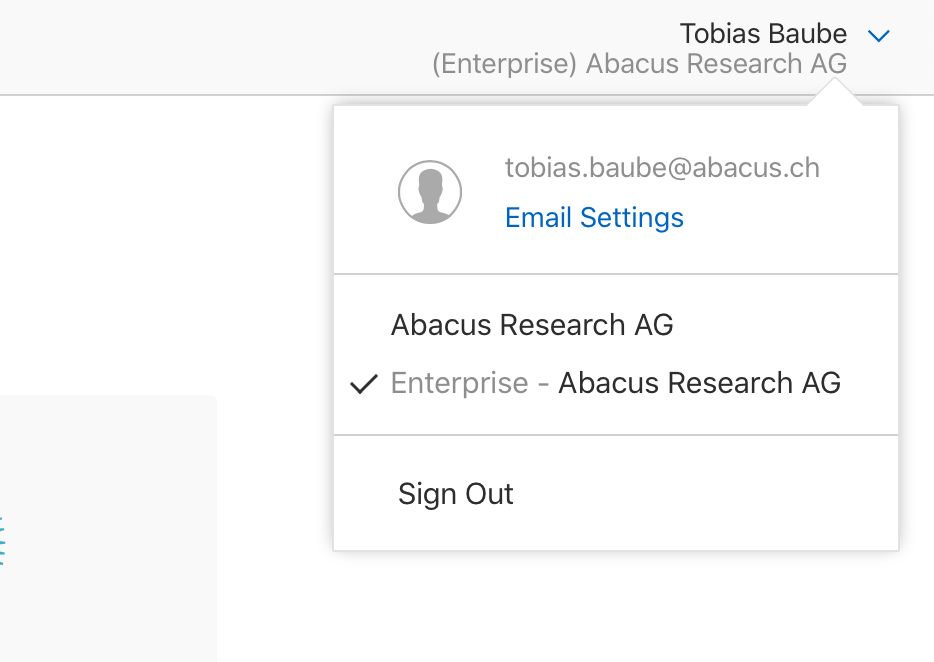
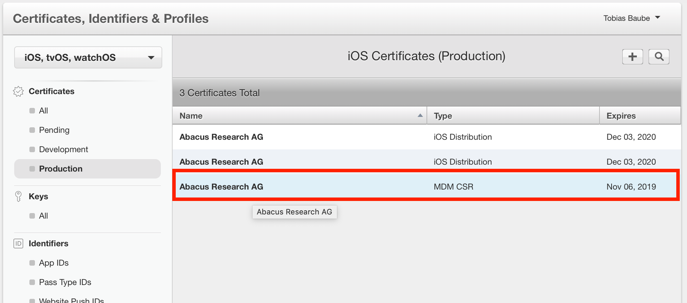
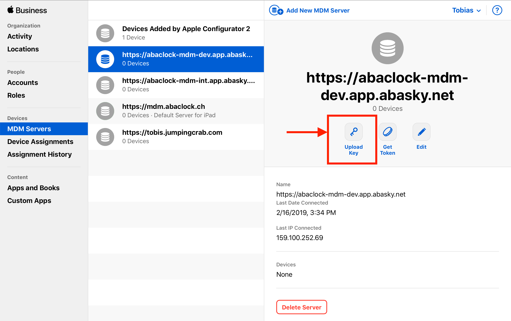

<!--ts-->
   * [MicroMDM - Abacus](#micromdm---abacus)
      * [Requirements](#requirements)
      * [Compiling](#compiling)
      * [Testing](#testing)
         * [Mysql - Only for Test environment!](#mysql---only-for-test-environment)
            * [Setup test account:](#setup-test-account)
            * [Run tests](#run-tests)
      * [Setup / Update micromdm.db](#setup--update-micromdmdb)
         * [mdmctl](#mdmctl)
            * [Configure later MDM Service](#configure-later-mdm-service)
            * [Assign Apple DEP Token](#assign-apple-dep-token)
            * [Assign Apple Push Certificate (APNS Cert)](#assign-apple-push-certificate-apns-cert)
         * [micromdm locally](#micromdm-locally)
         * [BoltDB - Document Store](#boltdb---document-store)
            * [Certificates](#certificates)
            * [DEP Token from Apple (.p7m)](#dep-token-from-apple-p7m)
            * [scep_certificates](#scep_certificates)
      * [Operations](#operations)
         * [Build with Docker File](#build-with-docker-file)
         * [Run](#run)
      * [Certificate Updates](#certificate-updates)
         * [MDM Certificate](#mdm-certificate)
         * [APNS Certificate](#apns-certificate)
         * [DEP Token](#dep-token)

<!-- Added by: baube, at:  -->
<!--te-->

# MicroMDM - Abacus
In addition, to official README of the source project: https://github.com/micromdm/micromdm

## Requirements

Make sure, go version 1.11 or newer is installed:
`go version`

For testing, install `goose`\
`brew install goose`

## Compiling
Run build in root directory of the project
`make build`

Will generate our executables in 
```
./build/darwin
./build/linux
```

Will also generate a `docker-compose-dev.yaml` file, for further configuration.

Choose your system (darwin/linux) and go to the directory.

```
# Executable for configuration and setup
./build/(darwin|linux)/mdmctl

# Executable for running the server
./build/(darwin|linux)/micromdm
```

## Testing
### Mysql - Only for Test environment!
#### Setup test account:
* username: micromdm
* password: micromdm
```
mysql -u root
mysql> CREATE USER 'micromdm'@'localhost' IDENTIFIED BY 'micromdm';
mysql> GRANT ALL PRIVILEGES ON *.* TO 'micromdm'@'localhost' IDENTIFIED BY 'micromdm';
```
#### Run tests
```
make db-mysql-migrate-test
make db-mysql-test
```

## Setup / Update micromdm.db
Once a year certificates need to be updated. Please perform the following 2 steps
1. Assign Apple DEP Token
2. Assign Apple Push Certificate (APNS Cert)

### mdmctl 
#### Configure later MDM Service
```
./mdmctl config set \
    -api-token secret \
    -name mdmexample \
    -server-url https://mdm.abacus.ch/
./mdmctl config switch -name mdmexample
```
Info: the above parameter `api-token` is a settable secret in your OpenShift configuration of the micromdm deployment.

#### Assign Apple DEP Token
1. Generate public key
```
./mdmctl get dep-tokens \
    -export-public-key ../../assets/mdm-certificates/dep_public_key.pem
```
2. Get DEP Token from business.apple.com
   1. Upload File from `./assets/mdm-certificates/dep_public_key.pem` to https://business.apple.com
   2. Download now the p7m file, which we will import to the mdm server, save as `./assets/mdm-certificates/dep_token.p7m`
   3. Set DEP Token for server:
   ```
   ./mdmctl apply dep-tokens \
       -import ../../assets/mdm-certificates/dep_token.p7m
   ```
3. Make sure, import worked --> result returned for
```
./mdmctl get dep-tokens
```

#### Assign Apple Push Certificate (APNS Cert)
To assign an Apple Push Certificate, start the server first (a Mysql database connection required, we won't store the certificate in a document store as the OpenSource solution does.)
We will need two Terminals/Consoles.

Run following command in Terminal 1
```
sudo ./micromdm serve \
    -config-path $(echo $(pwd)/../../build/) \
    -api-key secret \
    -tls-cert ./fullchain.pem \
    -tls-key ./privkey.pem \
    -server-url https://mdm.abacus.ch/
```
Info: the above parameter `api-token` is a settable secret in your OpenShift configuration of the micromdm deployment.

Now, when the server is running, add the Push certificate, from Terminal 2.
```
./mdmctl mdmcert upload \
    -password secret \
    -cert ../../assets/mdm-certificates/MDM_Abacus_Research_AG_Certificate.pem \
    -private-key ../../assets/mdm-certificates/PushCertificatePrivateKey.key
```

### micromdm locally
After configuring the MDM Service, run it.

```
sudo ./micromdm serve \
    -config-path $(echo $(pwd)/../../assets/) \
    -api-key secret \
    -server-url https://mdm.abacus.ch/ \
    -command-webhook-url http://127.0.0.1:5000/webhook \
    -mysql-username micromdm \
    -mysql-password micromdm \
    -mysql-database micromdm_test \
    -mysql-host 127.0.0.1 \
    -mysql-port 3306 \
    -tls=false
```
Info: the above parameter `api-key` equals the parameter `api-token` and is a settable secret in your OpenShift configuration of the micromdm deployment.

### BoltDB - Document Store
Currently, no relevant data should be stored anymore in the Mysql independant document store.\
If you run this MDM in OpenShift, a given document store should not be necessary being provided. In former versions, the document store was provided as secret in the OpenShift configuration.\
`./assets/micromdm.db`

By using the Bolter one can explore the document store (make sure its writable).
`bolter -f ./assets/micromdm.db`

#### Certificates
mdm.ServerConfig

#### DEP Token from Apple (.p7m)
mdm.DEPToken

#### scep_certificates
scep_certificates

## Operations
### Build with Docker File
Use ./Dockerfile to run the docker build
```
docker build . -t micromdm
```
### Run
Provide the path to the micromdm.db as variable `/data`
Due to our reverse proxy, we won't provide
* tls-cert
* tls-key

```
docker run -v /absolute/path/to/micromdm/assets/:/data  micromdm \
    micromdm serve \
    -config-path /data \
    -api-key secret \
    -server-url https://mdm.abacus.ch/ \
    -command-webhook-url http://127.0.0.1:5000/webhook \
    -mysql-username micromdm \
    -mysql-password micromdm \
    -mysql-database micromdm_test \
    -mysql-host 127.0.0.1 \
    -mysql-port 3306 \
    -tls=false
```
---
**Info**
* `api-key` - the above parameter `api-key` equals the parameter `api-token` and is a settable secret in your OpenShift configuration of the micromdm deployment.
* `server-url` - the publicly available url of the MDM server
* `command-webhook-url` - the URL of the MDM webhook interface, e.g. [.../post/mdm.php](https://abaclock-monitoring-dev.app.abasky.net/post/mdm.php) for [AbaClocK Monitor](https://github.com/abacusresearch/abaclock-monitoring)

---

## Certificate Updates
There are three certificates with expiration date +1 year in place:
1. MDM Certificate
2. APNS Certificate
3. DEP Token

### MDM Certificate

---
**Info**

Concerning Apple this certificate does not have to be renewed. I am not quite sure about this statement yet / Don't trust it. As a certificate that can expire and still be used for the `APNS Certificate`step does not really make sense...

---

The MDM Certificate is provided via Apple's Enterprise Developer Program. We had to request to get access to this program with our Team Administrator account. Steps to update this certificate:
1. Open https://developer.apple.com/account/ios/certificate
2. Make sure you selected the Enterprise team in the top right 
3. Select Certificates --> Production and Update the "MDM CSR" 
4. Run the command in Terminal. Make sure you got the right configuration for `mdmctl`
```
# Make sure the right configuration is selected
./mdmctl config switch -name mdmexample

# Request new certificate from our MDM Server
./mdmctl mdmcert vendor \
    -password=secret \
    -email=tobias.baube@abacus.ch \
    -country=CH
```
5. Upload `VendorCertificateRequest.csr` for `MDM CSR` on developer.apple.com with enter
6. Download `MDM Cer` to ./mdm-certificates/mdm.cer
7. Update the certificate and sign it
```
./mdmctl mdmcert push \
    -password=secret \
    -email=tobias.baube@abacus.ch \
    -country=CH
./mdmctl mdmcert vendor \
    -sign \
    -password=secret \
    -cert mdm-certificates/mdm.cer
```
8. Then renew the APNS Push Cert with downloaded `.plist` on https://identity.apple.com/pushcert/ - see APNS Certificate

### APNS Certificate
---
**Info**

This token may **NOT** expire and should **never** be revoked. Any enrolled iPads will not be reachable anymore by our server and would have to be enrolled again.

---

The APNS Certificate is the one we use to send Push notifications to the iPad via the Apple Push Notification Services.
1. Open https://identity.apple.com/pushcert/
2. The APNS Certificates are already set up. No need to create a new one. Instead **renew** the certificate. Do **NOT** Revoke this certificate or let it expire. Else we cannot reach the iPads anymore.
3. Select the Certificate you want to `renew`
4. Upload `.plist` from `MDM Certificate`
6. Download `.pem` file and store it as `MDM_Abacus_Research_AG_Certificate.pem` in your `./mdm-certificates` folder.
5. Update the certificate on the server. You **don't** have to restart the server, the update takes place immediately.
```
# Make sure the right configuration is selected
./mdmctl config switch -name mdmexample

# Request new certificate from our MDM Server
./mdmctl mdmcert upload \
    -password secret \
    -cert ./mdm-certificates/MDM_Abacus_Research_AG_Certificate.pem \
    -private-key ./mdm-certificates/PushCertificatePrivateKey.key

```

### DEP Token

---
**Info**

This token may expire but should be renewed.

---

If this Token was expired, its not too much of a problem. Enrolled iPads still can be reached and iPads that shall enroll as new iPads might have trouble. If we setup a new Token, it will work just fine again.

1. Open https://business.apple.com
2. Login with Admin Account
3. Select the Server you want to update in `MDM Servers`
4. Select `Upload Key` 
5. Get public key from our MDM Server
```
# Make sure the right configuration is selected
./mdmctl config switch -name mdmexample

# Request public key and store it
./mdmctl get dep-tokens \
    -export-public-key ~/Documents/dep_public_key.pem
```

6. Upload public key to https://business.apple.com
7. Download now the `.p7m` file, which we will upload to the mdm server. Rename it to `dep_token.p7m`
```
./mdmctl apply dep-tokens \
    -import ~/Downloads/dep_token.p7m
```
8. Make sure, import worked --> result returned for
``` 
./mdmctl get dep-tokens
```

>>>>>>> mysql
